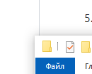

# lab1
1. Створив репозиторій засобами GitHub, клонував його на пк командою "git https://github.com/RoffyMonsta/Lomovatskyi.git DevOps", де DevOps це папка в яку я клонував репозиторій
2. Я відредагував файл командою "nano README.me", закомітив "git commit -m "comment" ", завантажив до репозиторію командою "git push"
3. Командою "git log" я отримав хеші:
1e5af92996acc433d565148835f6fd6841f8442b - перший хеш( створив README)
57cea1b5ea3be412ba625bb7654250d1e4da63ce - другий хеш ( відредагував README)
4. Створив гілку: git branch new_branch
	Створив гілку на віддаленому репо: git push origin new_branch
	Переключився на гілку: git checkout new_branch
5. Змін не відбулося, оскільки файл змінювався на другорядній гілці, і до головної не мав ніякої справи.
6. Командою "git merge new_branch" я злив два файли в один без помилок.
7. Конфлікту не відбулося, оскільки я не змінював попередню інформацію, а просто додав нову.
8. Створив папку командою mkdir, перемістив командою mv.
9. Очевидно що змін не відбулося, командою "git pull" я синхронізував зміни з віддаленного репо.
10. Picture:

