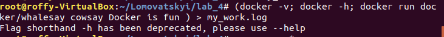

1. Done
2. Done

3. Done

4. Done
5-6. Done

[Docker HUB](https://cloud.docker.com/repository/registry-1.docker.io/roffymonsta/lab_4)

Видалення image: docker image rm roffymonsta/lab_4:django
7. DOne

8.
docker build -f DockerFileSecond -t roffymonsta/lab_4:djangoMONITORING .
docker push roffymonsta/lab_4:djangoMONITORING
docker run -it --name=djangoMONITORING --rm --net=host roffymonsta/lab_4:djangoMONITORING
DONE
