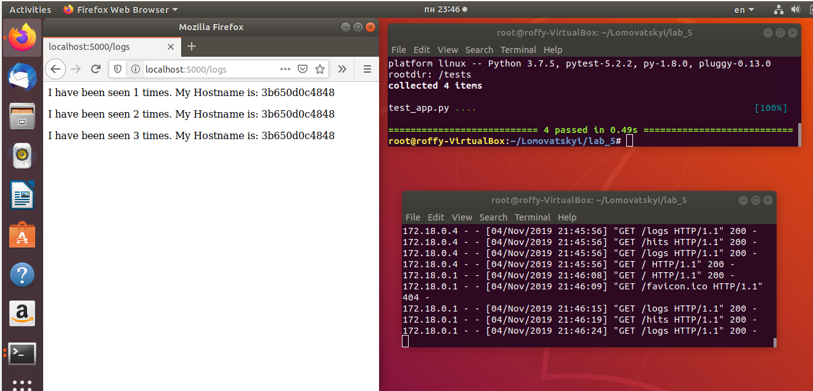
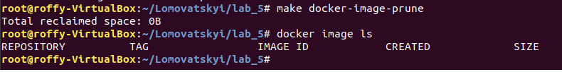
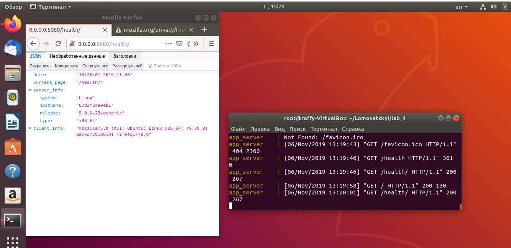

1-6. DONE_
7. It worked, but i had to some huge steps towards it:_
1) I had to add 127.0.0.1 redis in my /etc/hosts file_
2) i had to install redis-server and launch it_
3) i had to create a directory my_app/logs_
8)STATES := app tests - is a variable with dynamically assigned values. REPO := docker repo name..PHONY - is used to create a virtual target of makefile because STATE isn't a physical file. 
 $(STATES): - use of app or tests variables. docker build - creates new docker container. $(@) - variables from STATE(app, tests). run - execute commands. docker-prune - remove all the previous dockers._
9. Done!_
_
10-12. Done!_
_
13. Networks: public, secret. The names are as they are, it's about security_
14-18. Done! DockerHub [link](https://cloud.docker.com/repository/docker/roffymonsta/lab_5)!_
19. Makefile is better when we'd like to choose an option, and the docker-compose is better in automatic work with a lot of commands. This is a small project, so Makefile is better and more understandable in this case._
20. After a long time i made it. Installing requests and django in pipenv did the trick for me. Also you have to change allowed hosts and be careful with networks. Always clean docker with Makefile in lab5 after every try._
_
